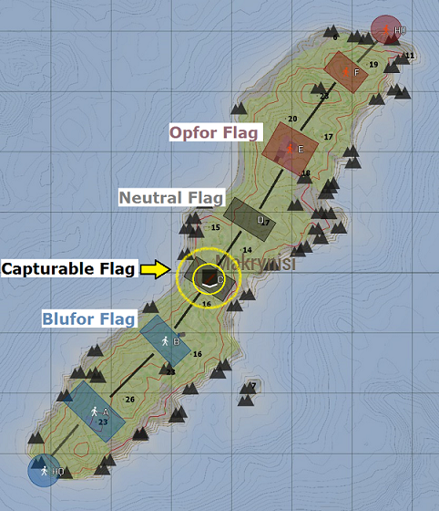

#HSLIDE
# FRONTLINE

An Arma 3 PvP mod based on PRA3

  - [website](http://www.frontline.frl)
  - [launcher](https://get.frontline.frl)
  - [discord](http://discord.frontline.frl) ask for `tester status`
  - [issue tracker](http://issues.frontline.frl)

'F' Fullscreen | '?' Help | 'O' Overview
#HSLIDE
### Prerequisite
[TeamSpeak 3 Client](http://www.teamspeak.com/downloads)

#HSLIDE
## How to launch it?
Launch the game using the [launcher](https://get.frontline.frl)

Press  for details on how to use it

#VSLIDE
## Launcher::Configure

#VSLIDE
## Launcher::Install mods

#VSLIDE
## Launcher::Play

This will also launch the `TS3 Client` and connect to the [Frontline TS3 Server](ts3server://frontline.frl)

#HSLIDE
## How to start?

#HSLIDE

#HSLIDE
### Join a squad and select a role

- Rifleman: _cannon fodder_
- Combat Life Saver: _armed nurse_
- Autorifleman: _suppression guy_
- Grenadier: _explosive stones thrower_
- Rifleman AT: _things go boom_
- Engineer: _crazy guy with shotgun and explosives_

Press  if you have what it takes to be a Squad Leader

#VSLIDE
### Squad Leaders
If you have commanding skills, then try `creating` a squad and become its Squad Leader (`SL`).
As such you can:
- Place `waypoints` to guide your squad members.
#VSLIDE
- Place Rally Points (`RP`): lasts for 2 minutes and has a 2 minutes cooldown period. Available only to your __squad members__
#VSLIDE
- Deploy Forward Outposts (`FOs`): requires two other __team__ mates nearby. Available to the __whole team__
#VSLIDE
- Coordinate with other `SL` over the radio (see [Communicate](#communicate))

#HSLIDE
### Select a spawn point
- Main base
- Uncontested flags ([Advance And Secure gamemode](#aasgamemode))
- Your squad Rally Point (`RP`). It only lasts for 2 minutes once deployed, make sure you time your respawn.
- Forward Outposts (`FO`)

#HSLIDE
## Playing the game

#HSLIDE
### Communicate:

<table>
<thead><tr><th>Keys</th><th>Action</th></tr></thead>
<tbody>
<tr>
  <td>TS push-to-talk button</td>
  <td>to speak on direct (configure in TeamSpeak settings)</td>
</tr>
<tr>
  <td><code>CAPS LOCK</code></td>
  <td>to speak to your squad</td>
</tr>
<tr>
  <td><code>CTRL</code>&nbsp;+&nbsp;<code>CAPSLOCK</code></td>
  <td>(SL only) to speak on the command channel with other SL</td>
</tr>
</tbody>
</table>

No radio configuration needed.

#HSLIDE
### Healing
- Access healing options using the __scroll wheel__
- Select `Field dressing` and hold `right mouse button` to bandage yourself. Apply several times if required (might need a medic to fully recover)

#VSLIDE
Before dying, a player becomes `incapacitated`, with a bleeding timeout of 2 minutes. To revive an incap player:

#VSLIDE
- Apply __1 single bandage__ by selecting `Field dressing` and holding `left mouse button`

#VSLIDE
- Inject `Adrenaline`

#VSLIDE
- Apply `Field dressing` again. Will require a medic to fully recover.

#VSLIDE
- If player is shacking, inject `Morphine`

#VSLIDE
- Drag an incapacitated team mate by pressing `E`

#VSLIDE
- Medics heal others __faster__ and are the only ones to make wounded players to __fully recover__ when applying `Field dressing`. If you are a medic, _stay alive!_, your squad needs you.

#HSLIDE
### Advance And Secure gamemode

Press  key for details

#VSLIDE

#VSLIDE
Controlling more than half of the flags will result in ticket bleed for the opposing team.
- Only your __current last flag__ can be taken by the enemy, defend it!
- Only the next enemy or neutral flag to your last can be taken, take it!

#VSLIDE
To capture a flag you must be within the marked area and the player count difference must be of at least one towards your team.
- First the game progressively `lowers` the enemy flag
- Then the area becomes neutral
- Finally it starts `raising` yours until the area is fully capped.

#VSLIDE
Ending the game:
- The team that captures all the flags within the time wins the round
- The team that reaches 0 tickets first loses the round.

#HSLIDE
### General tips
#VSLIDE
Play the objective

#VSLIDE
__Stick__ to your squad

#VSLIDE
Place marks on the map to let your team know of enemy locations:
  * Open the map
  * `Right click` and select your marker from the list.

#VSLIDE
- Destroy enemy `FOs` you find by tactical guarding it within a 75m radius for 2 minutes (minimum 2 players). During that period, the enemy `FO` will be _blocked_. If you leave the area without destroying it, it will remain blocked for 2 minutes.

#VSLIDE
Rearming

- Rearm at `RP` and `FO` by looking at it and pressing `F`. Available again in 5 minutes.

#HSLIDE
## Media

